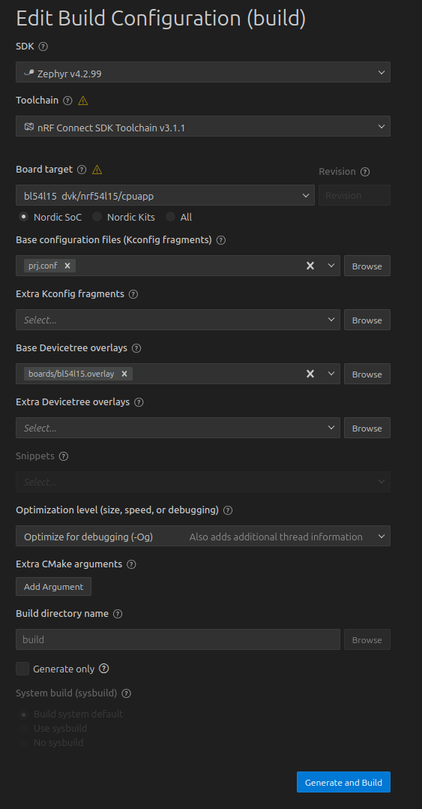

# BLE Debugger Firmware
## Requirements

- VS Code
- nRF Connect extension
- Segger JLINK drivers
- CP210x drivers?

## How to build

1. Open this directory with VS Code
2. Create a new build configuration in nRF connect
3. As target board, select `BL54L15 dvk/nRF54L15/cpuapp`
4. As base configuration file, select `prj.conf`
5. As base devicetree overlay, select `dts/bl54l15.overlay` (make sure there is a `/` instead of a backslash!!)
6. Click `Generate and Build`

To upload the firmware onto the device, connected the BLEDebugger via SWD and JLINK. Click `Flash` in the actions tab of nRF Connect.